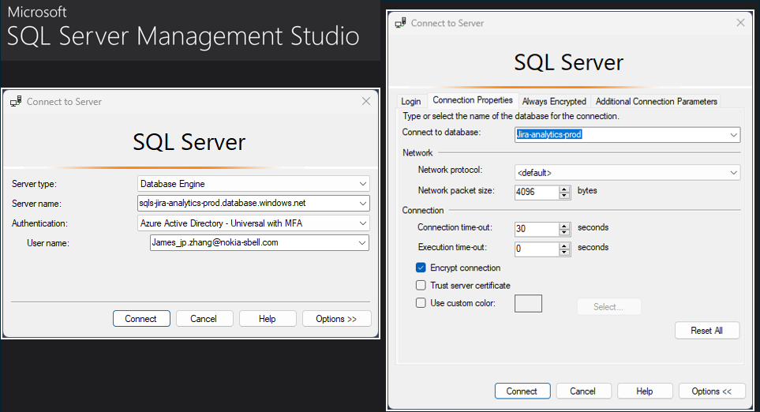
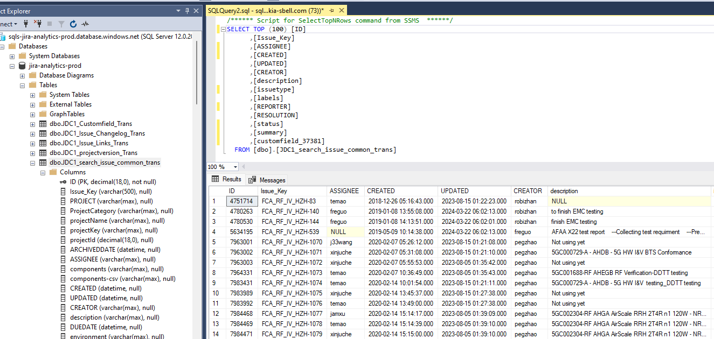

# Microsoft SQL

SQL - Structured Query Language

## URL

* [SQL Tutorials | W3C](https://www.w3schools.com/Sql/default.asp)
* [SQL Tryit Editor](https://www.w3schools.com/Sql/trysql.asp?filename=trysql_select_all)

## pyodbc

pyodbc is an open source Python module that makes accessing ODBC databases simple. It implements the DB API 2.0 specification but is packed with even more Pythonic convenience.
* [pyodbc Documentation](https://github.com/mkleehammer/pyodbc/wiki)
* [Python SQL Driver - pyodbc - Python driver for SQL Server | Microsoft Learn](https://learn.microsoft.com/en-us/sql/connect/python/pyodbc/python-sql-driver-pyodbc?view=sql-server-ver16&source=docs) - Step by step instruction for SQL server connection

-   [pyodbc objects](https://github.com/mkleehammer/pyodbc/wiki/Objects)
    -   [The pyodbc module itself](https://github.com/mkleehammer/pyodbc/wiki/The-pyodbc-Module)
    -   [Connection](https://github.com/mkleehammer/pyodbc/wiki/Connection)
    -   [Cursor](https://github.com/mkleehammer/pyodbc/wiki/Cursor)
    -   [Row](https://github.com/mkleehammer/pyodbc/wiki/Row)
    -   [Exceptions](https://github.com/mkleehammer/pyodbc/wiki/Exceptions)

### pyodbc for Microsoft Access 

* [how to use query in ms access with python | Code Ease](https://www.codeease.net/programming/python/how-to-use-query-in-ms-access-with-python)

```python
import pyodbc
# This will print the available Microsoft Assess Driver installed
[print(x) for x in pyodbc.drivers() if x.startswith('Microsoft Access Driver')] # > Microsoft Access Driver (*.mdb, *.accdb)
```
Here is an example of how to open an MS Access database:

```python
import pyodbc
conn_str = (
    r'DRIVER={Microsoft Access Driver (*.mdb, *.accdb)};'
    r'DBQ=C:\virtual_env\Project\jamesjpzhang\Access\Northwind.accdb;'
    )
cnxn = pyodbc.connect(conn_str)
crsr = cnxn.cursor()

# print all the available Table in the Access Database
for table_info in crsr.tables(tableType='TABLE'):
    print(table_info.table_name)
```

Output

```Txt
Customers
Employees
NorthwindFeatures
OrderDetails
Orders
OrderStatus
Products
SystemSettings
Welcome
```

Another Example

```python
import pyodbc

db_path = 'C:\\virtual_env\\Project\\jamesjpzhang\\Access\\Northwind.accdb'
connection_string = f'DRIVER={{Microsoft Access Driver (*.mdb, *.accdb)}};DBQ={db_path};'
conn = pyodbc.connect(connection_string)
cursor = conn.cursor()
query1 ="SELECT Customers.CustomerID, Customers.CustomerName FROM Customers"

cursor.execute(query1)
# Fetch all rows
rows = cursor.fetchall()
for row in rows:
    print(f"{row.CustomerID} {row.CustomerName}")
    
cursor.close()
conn.close()
```
Output

```text
1 Adatum Corporation
2 Adventure Works Cycles
3 Best For You Organics Company
4 Contoso, Inc.
5 Woodgrove Bank
6 Wide World Importers
7 Tailwind Traders
8 Proseware, Inc.
```

## Basic

```sql
-- Select
SELECT DISTINCT Company FROM Orders
SELECT * FROM Persons WHERE City='Beijing'
SELECT * FROM Persons WHERE Year>1965

-- select customer whose OrderPrice high than Average 
SELECT Customer FROM Orders
WHERE OrderPrice>(SELECT AVG(OrderPrice) FROM Orders)

-- IS NULL 用于测试是否为空值
SELECT LastName,FirstName,Address FROM Persons
WHERE Address IS NULL

-- COALESCE()
SELECT ProductName,UnitPrice*(UnitsInStock+COALESCE(UnitsOnOrder,0))
FROM Products

SELECT * FROM Persons WHERE (FirstName='Thomas' OR FirstName='William')
AND LastName='Carter'

SELECT Company, OrderNumber FROM Orders ORDER BY Company DESC, OrderNumber ASC

-- Insert new records
INSERT INTO Persons VALUES ('Gates', 'Bill', 'Xuanwumen 10', 'Beijing')
INSERT INTO Persons (LastName, Address) VALUES ('Wilson', 'Champs-Elysees')

-- Update
UPDATE Person SET Address = 'Zhongshan 23', City = 'Nanjing' WHERE LastName = 'Wilson'

-- Delete
DELETE FROM Person WHERE LastName = 'Wilson'
```

## Join table

* JOIN: 如果表中有至少一个匹配，则返回行 (same as Inner join)
* INNER JOIN: 在表中存在至少一个匹配时，INNER JOIN 关键字返回行
* LEFT JOIN: 即使右表中没有匹配，也从左表返回所有的行
* RIGHT JOIN: 即使左表中没有匹配，也从右表返回所有的行
* FULL JOIN: 只要其中一个表中存在匹配，就返回行

```sql
-- Join
SELECT Persons.LastName, Persons.FirstName, Orders.OrderNo
FROM Persons, Orders
WHERE Persons.Id_P = Orders.Id_P 

SELECT Persons.LastName, Persons.FirstName, Orders.OrderNo
FROM Persons
INNER JOIN Orders  
ON Persons.Id_P = Orders.Id_P
ORDER BY Persons.LastName

-- Union
SELECT E_Name FROM Employees_China
UNION
SELECT E_Name FROM Employees_USA
```
## Create Table
```sql
CREATE TABLE Persons
(
Id_P int NOT NULL,
LastName varchar(255) NOT NULL,
FirstName varchar(255),
Address varchar(255),
City varchar(255) DEFAULT 'Sandnes'  -- default value
)
```

TABLE

```sql
-- index_name are the column name for index
CREATE INDEX Index_Pers
ON Person (LastName, FirstName)

CREATE INDEX Index_Pers
ON Person (LastName DESC) 

-- add new column in Persons Table
ALTER TABLE Persons
ADD Birthday date

-- drop column in Table
ALTER TABLE Person
DROP COLUMN Birthday


```


## User Log in



My First SQL Query

```sql
/****** Script for SelectTopNRows command from SSMS  ******/
SELECT TOP (100) [ID]
      ,[Issue_Key]
      ,[ASSIGNEE]
      ,[CREATED]
      ,[UPDATED]
      ,[CREATOR]
      ,[description]
      ,[issuetype]
      ,[labels]
      ,[REPORTER]
      ,[RESOLUTION]
      ,[status]
      ,[summary]
      ,[customfield_37381]
  FROM [dbo].[JDC1_search_issue_common_trans]
```

